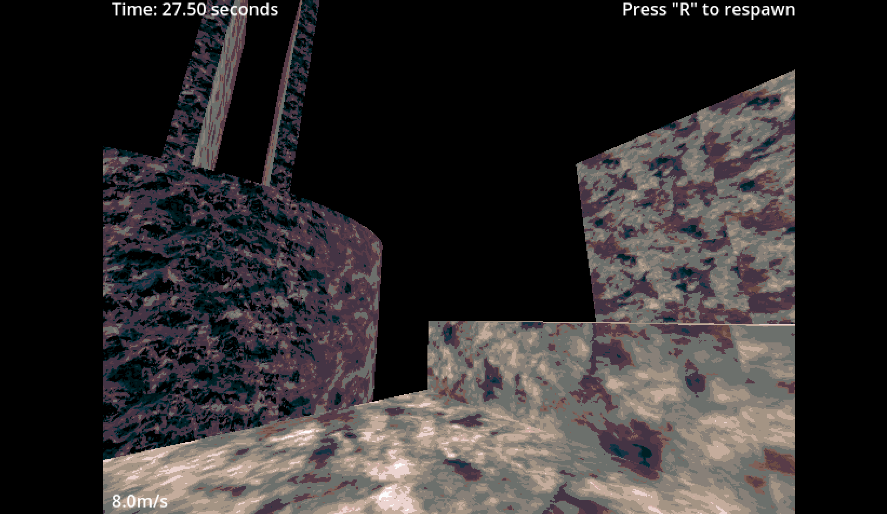

# Godot Movement Test
This was done to learn a bit of movement and styling.
This project is plagued by bugs.
Im going to make a Clean Movement project at some point this isn't it :)

W A S D -- to walk
SHIFT -- to Sprint
E -- In Air to Dash
STRG (CTL) C -- to slide
R -- to respawn

## Just a quick look to make this "presentable"

